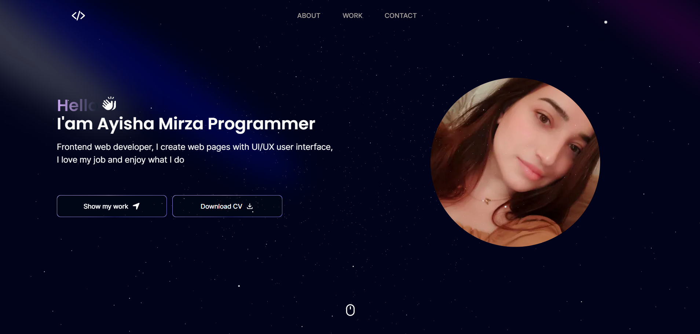

<div align="center">

  <h1 align="center">My Portfolio Website</h1>

  Next js is my website I developed with React Typescript <br /> 

<br>	

  <a href="https://my-potfolio-project-ayshenms-projects.vercel.app/"><strong> 📺 Live</strong></a> 

</div>

<br />

### ☑ Preview



<br>

### ☑ Requisites

Before you begin, ensure you have met the following requirements:

* [Git](https://git-scm.com/downloads "Download Git")  must be installed on your operating system.

<br>

### ☑ Run Locally

To run **PortfolioApp** locally, run following commands consecutively on your git bash:
```
 npm run dev .
```


<br>

### ☑ Technologies used

<br>

<div align="center">


</div>

<br>

### ☑ Contact

If you want to contact me, you can reach me over [Facebook](https://www.facebook.com/melan.xolik.39?mibextid=ZbWKwL),  [Linkedin](https://www.linkedin.com/in/ayshen-mirzayeva-462077167/)

<br>

### ☑ License

This project is **free to use** and does not contain any license.


<br>

### ☑ Creators

The project got prepared by a consistent effort of [Ayisha](https://github.com/ayshenm) 

<br>

<div align="center">
  
  
  
  
  [](https://youtube.com)
  

</div>
# Portfolio
